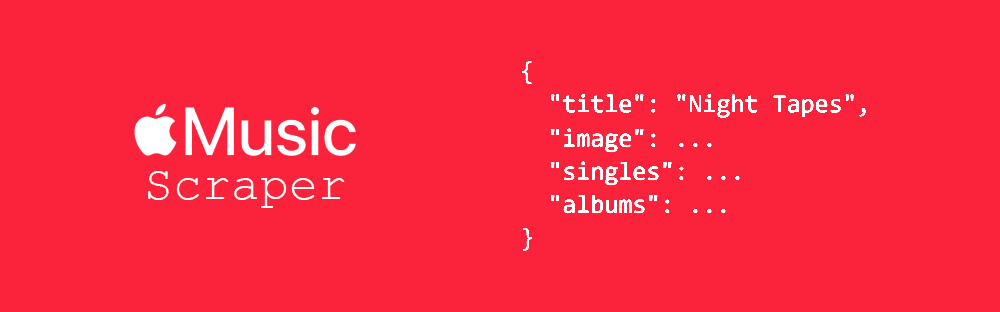

# Apple Music Scraper



**Apple Music Scraper** is a powerful tool for extracting rich data from Apple Music web pages using web scraping and reverse-engineered structure of `serialized-server-data`.

⚠️ This project is unofficial and purely for educational purposes. No official Apple API used.

<br>

## 📦 Installation

```bash
git clone https://github.com/Abssdghi/apple-music-scraper.git
cd apple-music-scraper
pip install -r requirements.txt
```


<br>


## 🔧 Functions

| Function               | Parameters                    | Description                                          |
|------------------------|------------------------------|------------------------------------------------------|
| `search(keyword)`      | `keyword: str`                | Search Apple Music for artists, songs, albums, playlists, and videos |
| `song_scrape(url)`     | `url: str`                   | Get metadata and preview URL of a song               |
| `album_scrape(url)`    | `url: str`                   | Get album details including songs, artist, similar albums, and videos |
| `playlist_scrape(url)` | `url: str`                   | Extract song URLs from a playlist                      |
| `room_scrape(url)`     | `url: str`                   | Extract song URLs from a shared room                   |
| `video_scrape(url)`    | `url: str`                   | Get video metadata including direct video URL and related content |
| `artist_scrape(url)`   | `url: str`                   | Get artist metadata including top songs, albums, videos, bio, and more |

Each function returns structured JSON containing metadata, URLs, images, previews, and related data.


<br>

## 🧠 Usage

Just import the scraper and call your function:

```python
from apple_music_scraper import *

result = search('night tapes')
artists = result['artists']

artist_url = artists[0]['url']
artist = artist_scrape(artist_url)

latest_night_tapes_song_url = artist['latest']

song = album_scrape(latest_night_tapes_song_url)
song_name = song['title']
song_cover = song['image']

print(f"\nLatest Night Tapes Song: {song_name}\nCover Art: {song_cover}\n")

```

<br>

## 📄 License

This project is licensed under the [MIT License](LICENSE).

<br>

## 🌟 Give it a Star

If you found this useful, feel free to ⭐️ the repo and share it with others!

<br>

Made with ☕ and 🎧 by [Abbas Sadeghi](https://github.com/abssdghi)